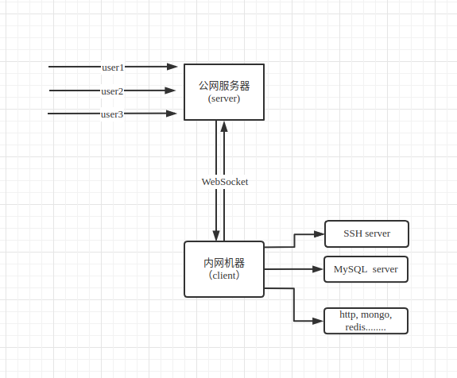
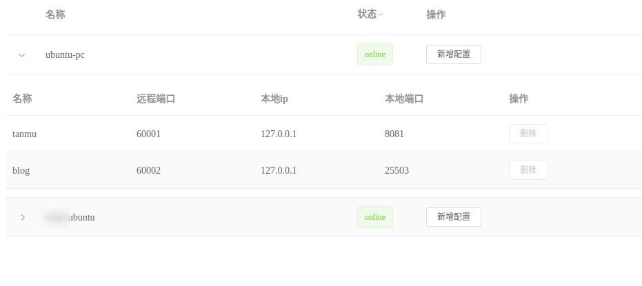

# 内网穿透工具
github: https://github.com/sazima/proxynt

## 原理


## 特性

1. 随时随地打开浏览器管理端口映射
2. 公网服务器和内网客户端之间只建立一个 WebSocket 连接
3. 依赖少. 工具用到的 Python 第三方库有: tornado, typing_extensions


## 常用场景
1. 在家托管网站服务器
2. 管理物联网设备

## 安装

安装

```
pip install proxynt
```

## 使用

客户端
```
nt_client -c config_c.json
```

服务端
```
nt_server -c config_s.json
```

服务端ui
```
管理页面路径为websocket路径+admin,
比如 
http://192.168.9.224:18888/websocketpath1/admin
```



## 示例, 通过 SSH 访问内网机器

假设公网机器的ip是 `192.168.9.224`

#### 1. 在公网机器上配置`config_s.json`

```json
{
  "port": 18888,
  "password": "helloworld",
  "path": "/websocket_path",
  "admin": {
    "enable": true,  
    "admin_password": "new_password"  
  }
}
```

说明: 
- `port`: 监听端口
- `password`: 连接密码
- `path`: websocket路径
- `admin`: 管理页配置(非必须)
- `admin.enable`: 是否启用管理页
- `admin.admin_password`: 管理密码

然后启动:
`nt_server -c config_s.json `

#### 2. 在需要被访问的内网电脑上配置`config_c.json`

配置config_c.json
 
```json
{
  "server": {
    "port": 18888,
    "host": "192.168.9.224",
    "https": false,
    "password": "helloworld",
    "path": "/websocket_path"
  },
  "client": [
    {
      "name": "ssh1",
      "remote_port": 12222,
      "local_port": 22,
      "local_ip": "127.0.0.1"
    }
  ]
}
```

然后启动: 
`nt_client -c config_c.json`

#### 3. ssh 连接: 
```
ssh -oPort=12222 test@192.168.9.224
```


#### 打开管理页面:

```
http://192.168.9.224:18888/websocketpath/admin
```

## 完整配置说明

- 客户端 config_c.json
```json5
{
  "server": {  // 要连接的服务端配置
    "port": 18888,  // 端口
    "host": "192.168.9.224",  // 端ip
    "https": false,  //服务端是否启动https
    "password": "helloworld",  // 密码
    "path": "/websocket_path"  // websocket 路径
  },
  "client": [  // 转发的配置列表
    {
      "name": "ssh",
      "remote_port": 1222,
      "local_port": 22,
      "local_ip": "127.0.0.1"
    },
    {
      "name": "mongo",
      "remote_port": 1223,
      "local_port": 27017,
      "local_ip": "127.0.0.1"
    }
  ],
  "client_name": "ubuntu1",  // 客户端名称, 要唯一
  "log_file": "/var/log/nt/nt.log"  // 日志路径
}
```


- 服务端 config_c.json
```json5
{
    "port": 18888,  // 监听端口
    "password": "helloworld",  // 密码
    "path": "/websocket_path",  // websocket路径
    "log_file": "/var/log/nt/nt.log",  // 日志路径
    "admin": {  
        "enable": true,  // 是否启用管理页
        "admin_password": "new_password"  // 管理页密码
    }
}
```
