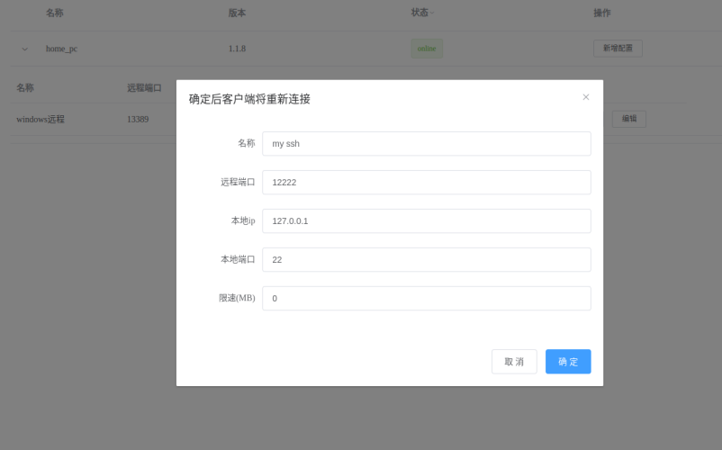

[中文](./readme.md)

ProxyNT is a reverse proxy server that can expose a local server to the internet through NATs and firewalls


## Features
1. Open port mapping via browser anytime and anywhere
2. Encrypted transmission between public network server and local network client via WebSocket
3. Few dependencies, one-click installation via pip
4. Stable, automatically reconnect, and already in production environment
5. Support for rate limiting

## Common Scenarios
1. Hosting website server at home
2. Managing IoT devices

## Installation

```
pip install -U proxynt
```


## Example: Accessing an Internal Network Machine via SSH

Suppose the public server's IP is 192.168.9.224.

#### 1. Create `config_s.json` file on the public network machine

`config_s.json` content:

```json
{
  "port": 18888,
  "password": "helloworld",
  "path": "/websocket_path",
  "admin": {
    "enable": true,  
    "admin_password": "new_password"  
  }
}
```


Then start:
`nt_server -c config_s.json`

Explanation:
- `port`: Listening port
- `password`: Connection password
- `path`: WebSocket path
- `admin`: Management page configuration (optional)
- `admin.enable`: Whether to enable management page
- `admin.admin_password`: Management password

#### 2. Create `config_c.json` file on the local network computer that needs to be accessed

`config_c.json` content:

```json
{
  "server": {
    "url": "ws://192.168.9.224:18888/websocket_path",
    "password": "helloworld"
  },
  "client_name": "home_pc"
}
```

Then start:
`nt_client -c config_c.json`

Explanation:
- `server`: Configuration of the server to be connected, including port, IP address, whether to use HTTPS, password, and WebSocket path.
- `client_name`: Client name, needs to be unique.
- `client`: Empty array.

#### 3. Open the server webpage `http://192.168.9.224:18888/websocket_path/admin` and add a port:




Explanation: The management page path is **WebSocket path + /admin** .
#### 4. Configuration succeeded, use SSH to connect:

```bash
ssh -oPort=12222 test@192.168.9.224
```


## Complete Configuration Instructions (please delete the comments when using)


- Client config_c.json

```json

{
  "server": {  // Server configuration to connect to
    "port": 18888,  // Port
    "host": "192.168.9.224",  // IP address
    "https": false,  // Whether the server is using HTTPS
    "password": "helloworld",  // Password
    "path": "/websocket_path"  // WebSocket path
  },
  "client": [  // List of forwarding configurations
    {
      "name": "ssh",
      "remote_port": 1222,
      "local_port": 22,
      "local_ip": "127.0.0.1"
    },
    {
      "name": "mongo",
      "remote_port": 1223,
      "local_port": 27017,
      "local_ip": "127.0.0.1"
    }
  ],
  "client_name": "ubuntu1",  // Client name, must be unique
  "log_file": "/var/log/nt/nt.log"  // Path to log file
}

```


- Server config_c.json

```json

{
    "port": 18888,  // Listening port
    "password": "helloworld",  // Password
    "path": "/websocket_path",  // WebSocket path
    "log_file": "/var/log/nt/nt.log",  // Path to log file
    "admin": {  
        "enable": true,  // Whether to enable admin page
        "admin_password": "new_password"  // Password for admin page
    }
}

```


## Stargazers over time

[](https://starchart.cc/sazima/proxynt)


## Update history

- 1.1.9: Bandwidth limitation
- 1.1.8: Display client version
- 1.1.7: Fixed duplicate client_name
- 1.1.6: Fixed client WebSocketException: socket is already opened.


